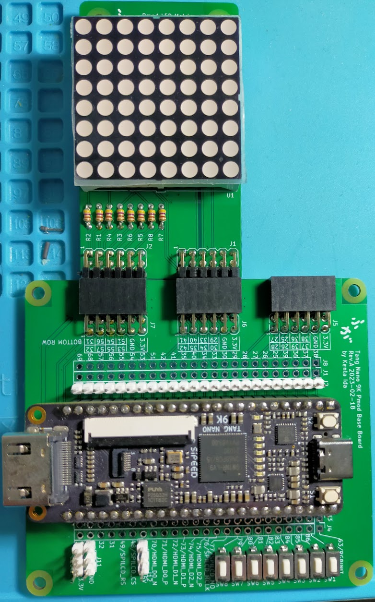

# Extension boards for Tang series FPGA boards.

## 概要

Sipeedが製造・販売している、Tang Nano 9K, Tang Nano 20K およびTang Primer 20K向けのベースボードおよび拡張基板の設計データです。

## 内容

### 対象ボード

| 名前            | 略称  | 説明                    | 購入先ページ                                              |
| :-------------- | :---- | :---------------------- | :-------------------------------------------------------- |
| Tang Nano 9K    | TN9K  | GW1NR-LV9搭載のボード。 | [秋月電子](https://akizukidenshi.com/catalog/g/gM-17448/) |
| Tang Primer 20K | TN20K | GW2A-LV18PG256          | [秋月電子](https://akizukidenshi.com/catalog/g/gM-17540/) |

### 基板一覧

| 名前                                                                        | 対象ボード | 説明                                            | KiCadプロジェクト                                                                  | リビジョン |
| :-------------------------------------------------------------------------- | :--------- | :---------------------------------------------- | :--------------------------------------------------------------------------------- | ---------- |
| [Tang Nano 9K Pmod Base Board](./README_TangNano_PmodBase.md)               | TN9K       | Tang Nano 9K用のPmod接続用ベースボード          | [TangNano_PmodBase.kicad_pro](./TangNano_PmodBase.kicad_pro)                       | Rev. B     |
| [Tang Primer 20K Pmod Extender ](./README_TangPrimer_PmodExtender.md)       | TP20K      | Tang Primer 20K用のPmod接続用拡張基板           | [TangPrimer_PmodExtender.kicad_pro](./TangPrimer_PmodExtender.kicad_pro)           | Rev. B     |
| [Pmod Debug Board](./README_Pmod_Debug.md)                                  | TN9K,TP20K | Pmodのデバッグ用中継基板                        | [Pmod_Debug.kicad_pro](./Pmod_Debug.kicad_pro)                                     | Rev. A     |
| Pmod HUB75 Connector Board                                                  | TN9K,TP20K | HUB75 LED Matrix接続用Pmod基板                  | [Pmod_HUB75.kicad_pro](./Pmod_HUB75.kicad_pro)                                     | Rev. A     |
| Pmod LED Board                                                              | TN9K,TP20K | Pmodのデバッグ用LED基板                         | [Pmod_LED.kicad_pro](./Pmod_LED.kicad_pro)                                         | Rev. A     |
| [Pmod Matrix LED](./README_Pmod_MatrixLED.md)                               | TN9K,TP20K | 8x8単色LEDマトリクスPmod基板                    | [Pmod_MatrixLED.kicad_pro](./Pmod_MatrixLED.kicad_pro)                             | Rev. B     |
| [Pmod MultiSegment (Single Port)](./README_Pmod_MultiSegment_SinglePort.md) | TN9K,TP20K | 6桁7+1セグメントLED Pmod基板 (シングルポート版) | [Pmod_MultiSegment_SinglePort.kicad_pro](./Pmod_MultiSegment_SinglePort.kicad_pro) | Rev. A     |

## ライセンス

 この 作品 は <a rel="license" href="http://creativecommons.org/licenses/by/4.0/">クリエイティブ・コモンズ 表示 4.0 国際 ライセンス</a>の下に提供されています。