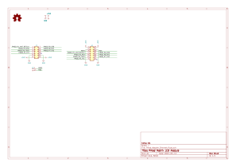
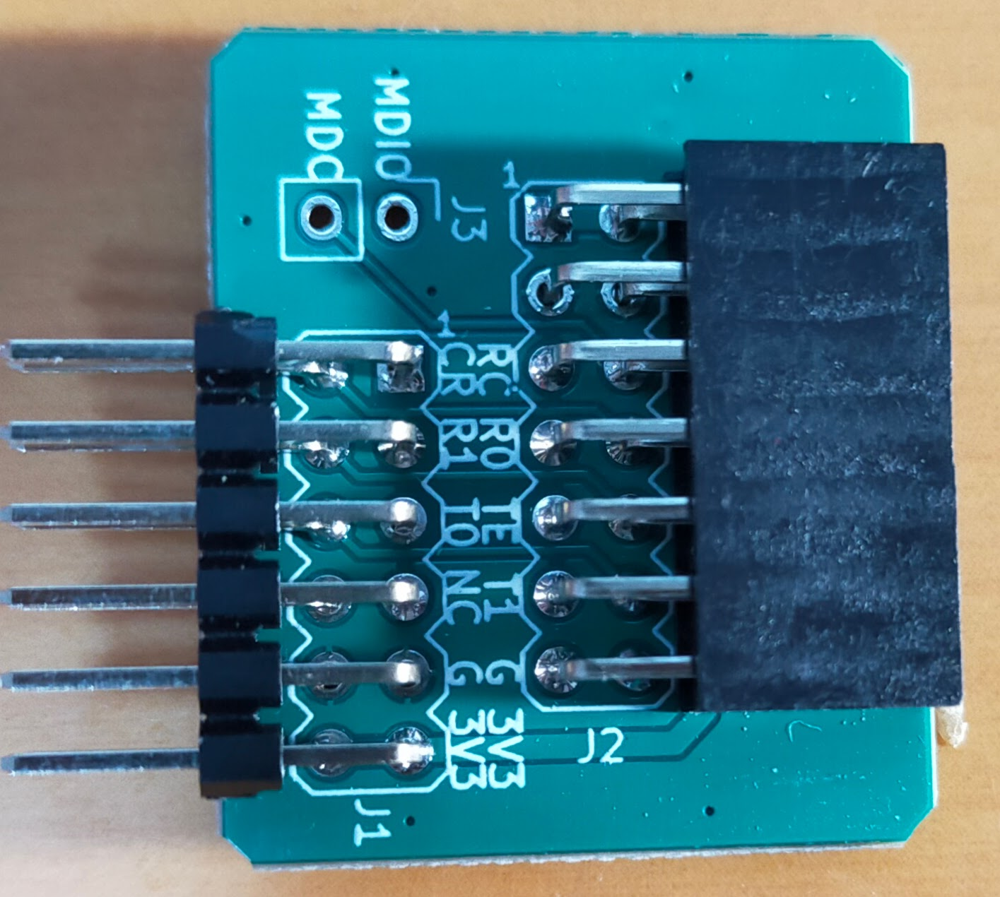
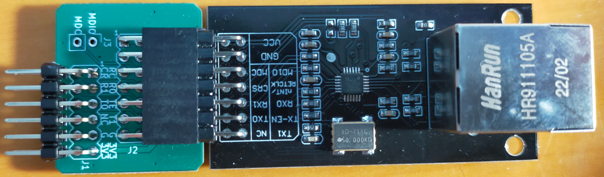

# Ethernet Pmod Adapter

## 概要

Waveshareやその他の互換ボードメーカーが販売しているMicrochip LAN8720を使ったEthernet PHYボードをPmodポートに接続するためのアダプタです。

* WaveshareのLAN8720ボード https://www.waveshare.com/lan8720-eth-board.htm
* Amazonで買える互換品 (不良品率高いので注意) https://www.amazon.co.jp/KKHMF-%E9%AB%98%E6%80%A7%E8%83%BDLAN8720%E3%82%A4%E3%83%BC%E3%82%B5%E3%83%8D%E3%83%83%E3%83%88%E3%83%9C%E3%83%BC%E3%83%8910-100%E3%82%A4%E3%83%BC%E3%82%B5%E3%83%8D%E3%83%83%E3%83%88%E7%89%A9%E7%90%86%E5%B1%A4%E3%83%88%E3%83%A9%E3%83%B3%E3%82%B7%E3%83%BC%E3%83%90%EF%BC%88PHY%EF%BC%89%E3%83%A2%E3%82%B8%E3%83%A5%E3%83%BC%E3%83%AB%E3%82%AD%E3%83%83%E3%83%88%E7%B5%84%E3%81%BF%E8%BE%BC%E3%81%BFWeb-3-3V%E3%82%B5%E3%83%BC%E3%83%90-%E3%83%8D%E3%83%83%E3%83%88%E3%83%AF%E3%83%BC%E3%82%AF%E3%83%A2%E3%82%B8%E3%83%A5%E3%83%BC%E3%83%AB/dp/B0991R9Q8Z/

## 部品リスト

| リファレンス                            | 個数 | 値                                                    | 購入元                                                                                                                                                | 備考                                       |
| :-------------------------------------- | ---- | ----------------------------------------------------- | ----------------------------------------------------------------------------------------------------------------------------------------------------- | ------------------------------------------ |
| J1                                      | 1    | 2x6 2.54 ライトアングル ピンヘッダ                    | [秋月電子](https://akizukidenshi.com/catalog/g/g116794/)                                                                                              |                                            |
| J2                                      | 1    | 2x7 2.54mm ライトアングル ピンソケット                | 2x10 ピンソケット [秋月電子](https://akizukidenshi.com/catalog/g/g105755/)                                                                            | 2x7に折って使う                            |

### 秋月買い物リスト用

秋月で部品をそろえる場合のリスト。

| リファレンス | 個数 | セット数 | 値                         | 秋月番号 |
| :----------- | ---: | -------: | -------------------------- | -------: |
| J1           |    1 |        1 | ピンヘッダー L型 2×6 (12P) |   116794 |
| J2           |    3 |        1 | L型ピンソケット 2×10(20P)  |   105755 |

## 回路図

[回路図 (PDF)](./doc/Pmod_Adapter_Ethernet.pdf)

## 外観

## サンプルプロジェクト

[Tang Nano 9K向けサンプル](https://github.com/ciniml/fpga_samples/tree/main/eda/ethernet_icmp/src/tangnano9k_pmod)