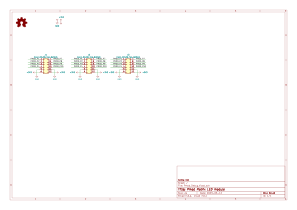
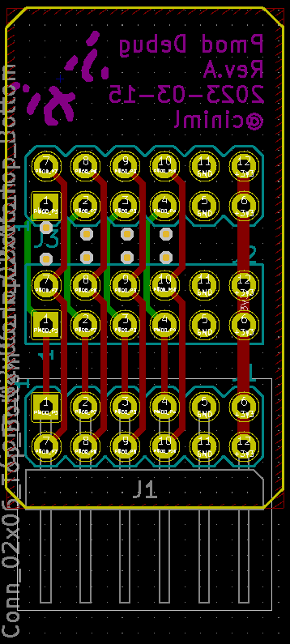
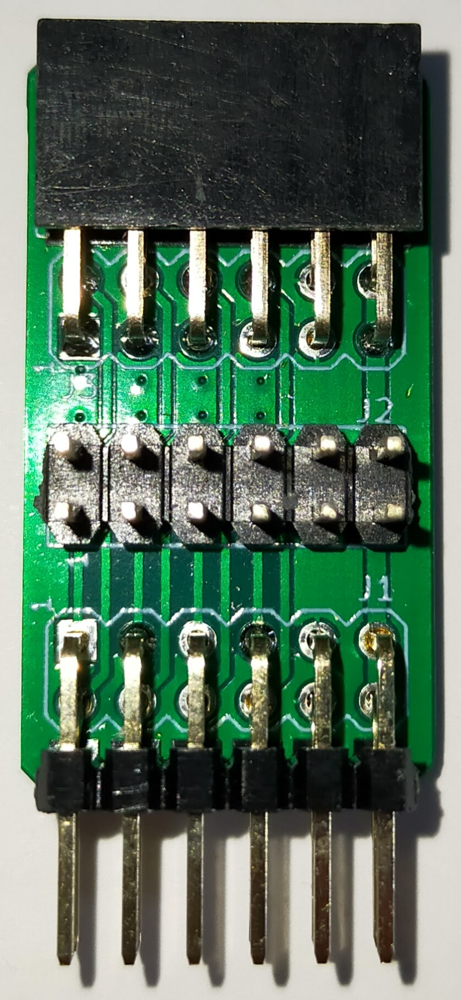
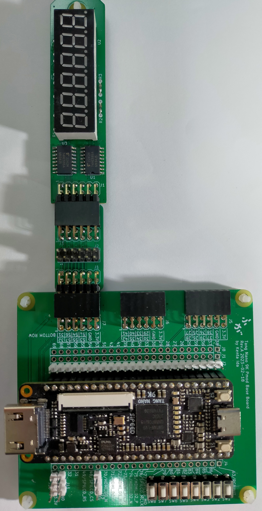

# Pmod Debug 中継基板

## 概要

PmodモジュールとPmod対応ボードの間に挿入して、Pmodの信号線をロジック・アナライザ等で観測しやすくするための中継基板です。

## 部品リスト

| リファレンス | 個数 | 値                                     | 購入元                                                    | 備考          |
| :----------- | ---- | -------------------------------------- | --------------------------------------------------------- | ------------- |
| J1,          | 1    | 2x6 2.54mm ライトアングル ピンヘッダ   | [秋月電子](https://akizukidenshi.com/catalog/g/gC-00148/) | 2x6で分割する |
| J2,          | 1    | 2x6 2.54mm ピンヘッダ                  | [秋月電子](https://akizukidenshi.com/catalog/g/gC-00167/) | 2x6で分割する |
| J3,          | 1    | 2x6 2.54mm ライトアングル ピンソケット | [秋月電子](https://akizukidenshi.com/catalog/g/gC-16795/) | 2x6で分割する |

## 回路図

[回路図 (PDF)](./doc/Pmod_Debug.pdf)

## 外観

