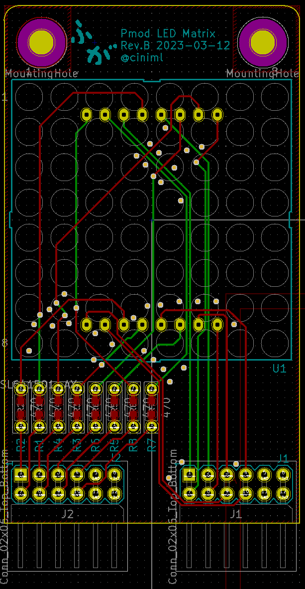
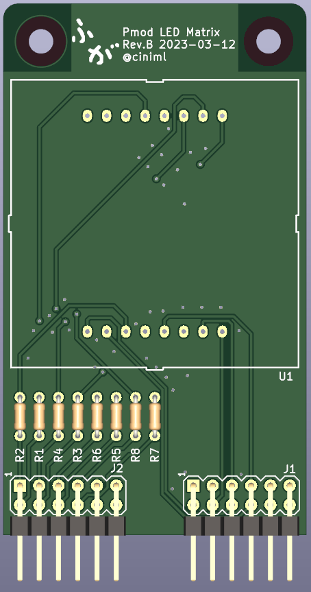
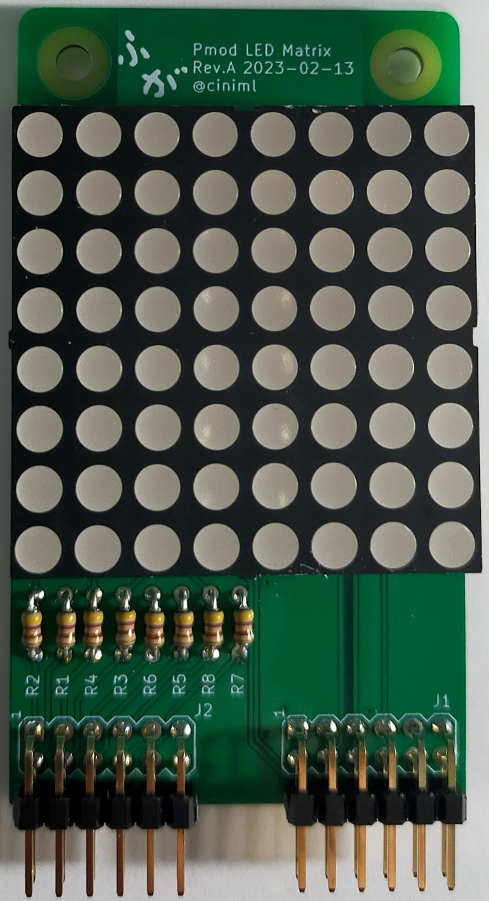

# Pmod Matrix LED

## 概要

秋月電子で購入可能なOptosupplyの8x8マトリクスLED OSL641501-AXA のPmodモジュールです。Pmod 2ポート使用。

## 部品リスト

| リファレンス                    | 個数 | 値                                   | 購入元                                                    | 備考          |
| :------------------------------ | ---- | ------------------------------------ | --------------------------------------------------------- | ------------- |
| J1, J2,                         | 2    | 2x6 2.54mm ライトアングル ピンヘッダ | [秋月電子](https://akizukidenshi.com/catalog/g/gC-00148/) | 2x6で分割する |
| R1, R2, R3, R4, R5, R6, R7, R8, | 8    | 470Ω 1/6W                            | [秋月電子](https://akizukidenshi.com/catalog/g/gR-16471/) |               |
| U1,                             | 1    | OSL641501-ARA                        | [秋月電子](OSL641501-AXA)                                 |               |

## 外観

## サンプルプロジェクト

[Tang Nano 9K向けサンプル](https://github.com/ciniml/fpga_samples/tree/main/eda/cpu_matrix_led/src/tangnano9k_pmod)

[Tang Primer 20K向けサンプル](https://github.com/ciniml/fpga_samples/tree/main/eda/cpu_matrix_led/src/tangnano9k_pmod)
