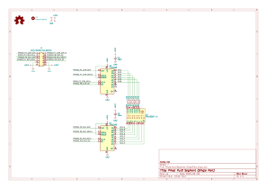

# Pmod MultieSegment (Single Port版)

## 概要

秋月電子で購入可能なOptosupplyの6桁 7+1セグメントLED [OSL60362-LR](https://akizukidenshi.com/catalog/g/gI-17987/) のPmodモジュールです。
単純に接続した場合は2ポート必要になりますが、8bitシフトレジスタを使って桁選択とセグメント出力をそれぞれ4線で制御し、Pmod 1ポートに収めています。
FPGA側の制御回路は少し複雑になりますが、Pmodポートを他につかうことができます。

## 部品リスト

| リファレンス            | 個数 | 値                                   | 購入元                                                                     | 備考                       |
| :---------------------- | ---- | ------------------------------------ | -------------------------------------------------------------------------- | -------------------------- |
| J1,                     | 1    | 2x6 2.54mm ライトアングル ピンヘッダ | [秋月電子](https://akizukidenshi.com/catalog/g/gC-00148/)                  | 2x6で分割する              |
| R1, R2, R3, R4, R5, R6, | 6    | 470Ω 1/6W                            | [秋月電子](https://akizukidenshi.com/catalog/g/gR-16471/)                  |                            |
| U2,                     | 1    | OSL60362-LX                          | [秋月電子](https://akizukidenshi.com/catalog/g/gI-17987/) | カソードコモンタイプを使う |                     |
| U1, U3                     | 2    | TC74HC595AF                          | [秋月電子](https://akizukidenshi.com/catalog/g/gI-10077/) |  |                     |

## 回路図

## 外観

準備中

## サンプルプロジェクト

準備中
