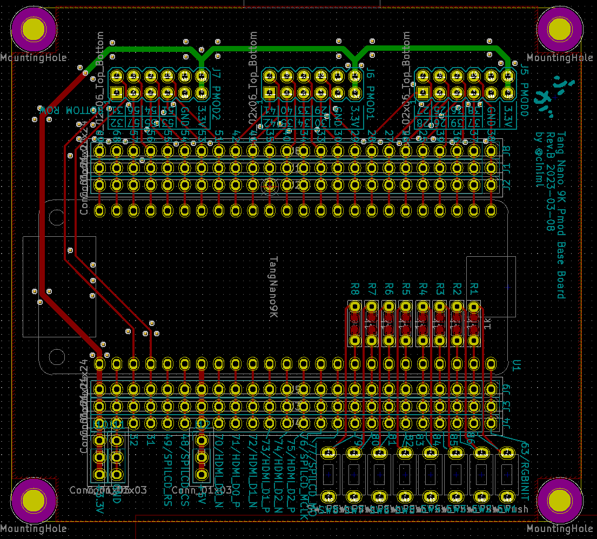
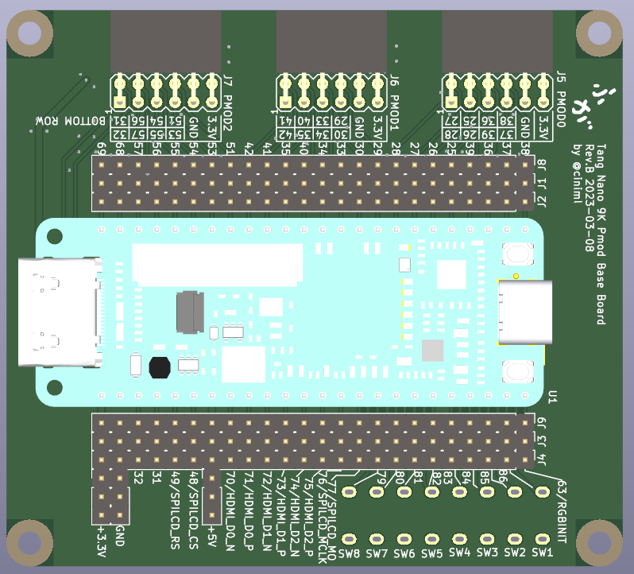
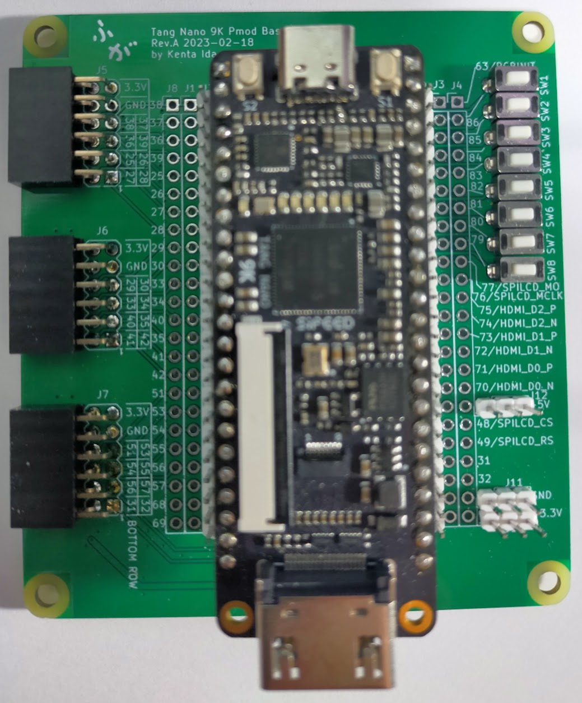

# Tang Nano 9K Pmod Base Board

## 概要

Tang Nano 9K用のPmod接続用ベースボード。Pmod 3ポート使用可能。 Pmodの信号線はすべて3.3V。 8個のタクトスイッチを実装可能 (すべて1.8V系ピン使用)

## 部品リスト

| リファレンス                            | 個数 | 値                                                    | 購入元                                                                                                                                                | 備考                                         |
| :-------------------------------------- | ---- | ----------------------------------------------------- | ----------------------------------------------------------------------------------------------------------------------------------------------------- | -------------------------------------------- |
| J1, J2, J3, J4, J8, J9,                 | 6    | 1x24 2.54mm ピンヘッダ or ピンソケット                | ピンヘッダ [秋月電子](https://akizukidenshi.com/catalog/g/gC-00167/)   ピンソケット [秋月電子](https://akizukidenshi.com/catalog/g/gC-05779/)     | 使い方に応じてヘッダ・ソケット好きな方を実装 |
| J5, J6, J7,                             | 3    | 2x6 2.54mm ライトアングル ピンソケット                | [秋月電子](https://akizukidenshi.com/catalog/g/gC-16795/)                                                                                             |                                              |
| J10, J11, J12,                          | 3    | 1x3 2.54mm ピンヘッダ                                 | ピンヘッダ [秋月電子](https://akizukidenshi.com/catalog/g/gC-00167/)                                                                                  |                                              |
| R1, R2, R3, R4, R5, R6, R7, R8,         | 8    | 1kΩ 1/6                                               | [秋月電子](https://akizukidenshi.com/catalog/g/gR-16102/)                                                                                             |                                              |
| SW1, SW2, SW3, SW4, SW5, SW6, SW7, SW8, | 8    | TVBP06-B043CW-B タクトスイッチ                        | [秋月電子](https://akizukidenshi.com/catalog/g/gP-08074/)                                                                                             |                                              |
| U1,                                     | 2    | TangNano9K接続用ピンソケット 1x24 2.54mm ピンソケット | ピンソケット [秋月電子](https://akizukidenshi.com/catalog/g/gC-05779/)   細ピンソケット [秋月電子](https://akizukidenshi.com/catalog/g/gC-10073/) | 細にしておくとブレッドボードと共用しやすい   |
|                                         | 2    | TangNano9K接続用ピンヘッダ 1x24 2.54mm ピンヘッダ     | ピンヘッダ [秋月電子](https://akizukidenshi.com/catalog/g/gC-00167/)   細ピンヘッダ [秋月電子](https://akizukidenshi.com/catalog/g/gC-06631/)     | 細にしておくとブレッドボードと共用しやすい   |

### 秋月買い物リスト用

秋月で部品をそろえる場合のリスト。Tang Nano 9Kに細ピンヘッダを使用、信号引き出しのピンは、ピンソケット 1列、ピンヘッダ 2列の構成

| リファレンス                            | 個数 | セット数 | 値                                     | 秋月番号 |
| :-------------------------------------- | ---: | -------: | -------------------------------------- | -------: |
| J1, J2, J3, J4, J8, J9,                 |    6 |        6 | 1x24 2.54mm ピンヘッダ                 |   100167 |
| J10, J11, J12,                          |    3 |        1 | 1x3 2.54mm ピンヘッダ                  |   100167 |
| J2, J9,                                 |    2 |        2 | 1x24 2.54mm ピンソケット               |   105779 |
| J5, J6, J7,                             |    3 |        3 | 2x6 2.54mm ライトアングル ピンソケット |   116795 |
| R1, R2, R3, R4, R5, R6, R7, R8,         |    8 |        1 | 1kΩ 1/6                                |   116102 |
| SW1, SW2, SW3, SW4, SW5, SW6, SW7, SW8, |    8 |        8 | TVBP06-B043CW-B タクトスイッチ         |   108074 |
| U1,                                     |    2 |        2 | 1x24 2.54mm 細ピンソケット             |   110073 |
|                                         |    2 |        2 | 1x24 2.54mm 細ピンヘッダ               |   106631 |
|                                         |    1 |        1 | Tang Nano 9K                           |   117448 |

## 回路図

[回路図 (PDF)](./doc/TangNano_PmodBase_Schematic.pdf)

## 外観

## サンプルプロジェクト

[Tang Nano 9K向けサンプル](https://github.com/ciniml/fpga_samples/tree/main/eda/cpu_matrix_led/src/tangnano9k_pmod)