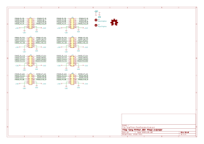
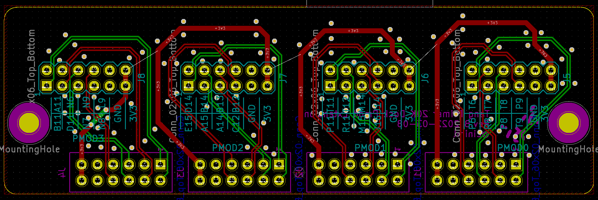
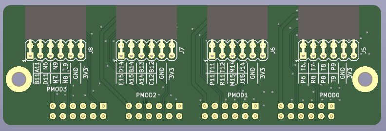
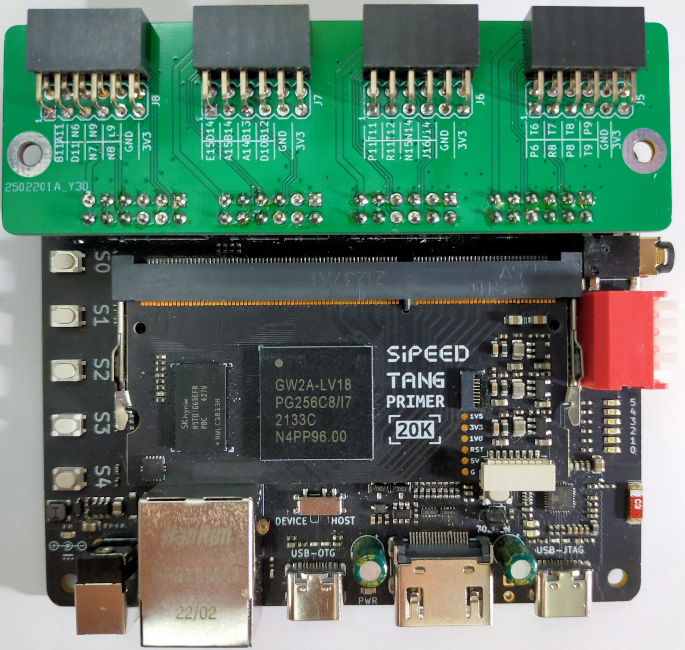

# Tang Primer 20K Pmod Extender

## 概要

Tang Primer 20K用のPmod接続用拡張ボード。

Tang Primer 20KにはもともとPmod相当のポートが4つついているが、Pmod規格が定める形状の制約を満たしておらず、Pmod規格ボードを接続することが難しい。
Tang Primer 20K Pmod ExtenderはTang Primer 20KのPmod相当ポート4つに接続し、各ポートをPmod規格が定める向きおよび配置に変換します。

## 部品リスト

| リファレンス    | 個数 | 値                                     | 購入元                                                               | 備考 |
| :-------------- | ---- | -------------------------------------- | -------------------------------------------------------------------- | ---- |
| J1, J2, J3, J4, | 4    | 2x6 2.54mm ピンヘッダ                  | ピンヘッダ [秋月電子](https://akizukidenshi.com/catalog/g/gC-00167/) |      |
| J5, J6, J7, J8, | 4    | 2x6 2.54mm ライトアングル ピンソケット | [秋月電子](https://akizukidenshi.com/catalog/g/gC-16795/)            |      |

## 回路図

## 外観

## サンプルプロジェクト

[Tang Primer 20K向けサンプル](https://github.com/ciniml/fpga_samples/tree/main/eda/cpu_matrix_led/src/tangprimer20k)